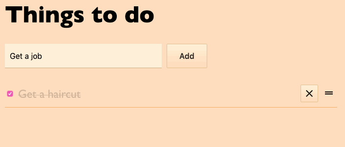

# CSS in JS Animations

This is an exploration how [CSS transitions](https://developer.mozilla.org/en-US/docs/Web/CSS/CSS_Transitions/Using_CSS_transitions), [keyframe animations](https://developer.mozilla.org/en-US/docs/Web/CSS/@keyframes) and [react-transition-group](reactcommunity.org/react-transition-group/) works with a CSS-in-JS library like [Emotion](https://emotion.sh/) compared to a "vanilla CSS" implementation.

## Sample application

The sample application is a todo list that animates adding, removing, modifying
and reordering items.

The application state logic can be found in the `shared` package and is re-used
across all UI implementations.
yarn
## Try it out

1. Clone this repo
2. Run `yarn`
3. Build the shared code `yarn workspace shared build`

### Vanilla example

Just using regular CSS classes in this example as a benchmark.

`yarn workspace vanilla start`

### Emotion example

This example uses the [Emotion](https://emotion.sh/) CSS-in-JS framework.

`yarn workspace emotion start`